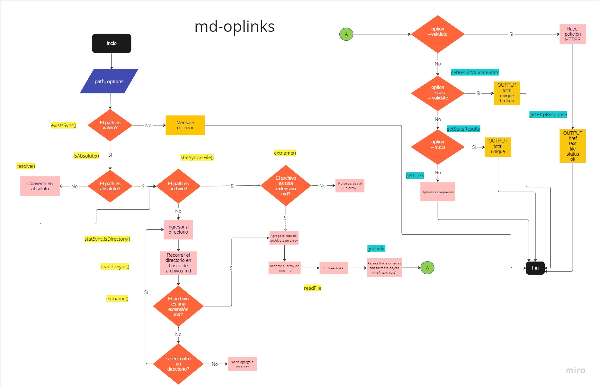

# md-oplinks

## Índice

* [1.¿Que es md-oplinks y para que sirve?](#a
)
* [2. Resumen del proyecto](#2-resumen-del-proyecto)
* [3. Objetivos de aprendizaje](#3-objetivos-de-aprendizaje)
* [4. Consideraciones generales](#4-consideraciones-generales)
* [5. Criterios de aceptación mínimos del proyecto](#5-criterios-de-aceptación-mínimos-del-proyecto)
* [6. Entregables](#6-entregables)
* [7. Hacker edition](#7-hacker-edition)
* [8. Pistas, tips y lecturas complementarias](#8-pistas-tips-y-lecturas-complementarias)
* [9. Checklist](#9-checklist)
* [10. Achicando el problema](#10-achicando-el-problema)
* [HOLA]

***

## 

 
 
 

#### ¿Que es md-oplinks y para que sirve?<a name='a'></a>
Es una herramienta de linea de comando (CLI) y una libreria instalable que facilita a los usuarios buscar y analizar archivos markdown (.md). Esta permite verificar si estan funcionando correcatamente o presentan links invalidos o, como comunmente se les conoce 'links rotos'.

Este programa esta estructurado de la siguiente manera: 




#### ¿Como instalar?<a></a>

Para instalar la libreria debes seguir los siguientes pasos:

1. Abre la terminal de tu sistema operativo.
2.  Navegue hasta el directorio raíz de su proyecto o la ubicación donde desea instalar la biblioteca.
2. Ejecute el siguiente comando en la terminal para instalar la biblioteca desde el registro del paquete npm: 
```sh
npm md-oplinks install
```
3. Una vez completada la instalación, puede importar y usar la biblioteca en su proyecto de acuerdo con las instrucciones de uso proporcionadas en la guía de uso.


#### ¿Como usar?

Una vez instalado, debes colocar en la terminal lo siguiente: 

```sh
md-oplinks <path> [opciones]
```
 donde:
 path = es la ruta que se quiere analizar. Cabe destacar que la ruta puede ser absoluta o relativa. 

 options = es la manera en el CLI retorna los resultados. 

 Si se ingresa
  ```sh 
  --validate 
  ```
  El módulo hara una solicitud HTTP para verificar si el o los links encontrados funcionan o no y en el output se obtendrá 
    href,
    text,
    file,
    status,
    ok.

Por ejemplo:

```sh
$ md-oplinks ./some/example.md --validate
./some/example.md http://algo.com/2/3/ ok 200 Link a algo
./some/example.md https://otra-cosa.net/algun-doc.html fail 404 algún doc
./some/example.md http://google.com/ ok 301 Google
```

 Si se ingresa 
  ```sh 
  --stats 
  ```
Se recibirá un texto con estadísticas básicas sobre los enlaces, incluyendo el número total de enlaces y el número de enlaces únicos.

Por ejemplo: 

```sh
$ md-oplinks ./some/example.md --stats
Total: 3
Unique: 3
```

 Si se ingresa 
  ```sh 
  -- validate --stats 
  ```
 Se obtendrá un texto con estadísticas completas que incluyen enlaces invalidos o "rotos". 

 Por ejemplo:

   ```sh
$ md-oplinks ./some/example.md --stats --validate
Total: 3
Unique: 3
Broken: 1
```